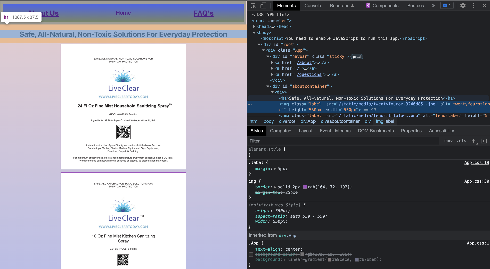

February 2022

 

Hello & Thanks for stopping by!

I am a Full Stack Web Developer fellow at Pursuit with an anticipated completion date of June 2022.

My role in this project was to design, develop, test, debug, and deploy the integrated REST API & database using Express.js, Node.js, pg-promise and PostgreSQL.

While not contructing class projects I am studying Algorithims, SQL, & rebuilding my product website.
 
When away from the computer I enjoy creating unique & healthy dishes, spending time in nature, & writing.
⭐️
 

[LinkedIn] (https://www.linkedin.com/in/debdev3)

 

